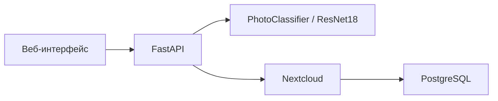

# PhotoDistribution

PhotoDistribution — сервис автоматической классификации изображений и их
распределения по папкам Nextcloud. FastAPI принимает изображения, модель
ResNet18 определяет категорию, после чего файл загружается в соответствующую
папку Nextcloud.

Поддерживаемые категории модели:

- `animals`;
- `city`;
- `documents`;
- `nature`;
- `people`.

## Архитектура



Основные компоненты:

- `app.py` — HTTP API, авторизация, валидация файлов и lifecycle приложения;
- `service_ml.py` — безопасная загрузка checkpoint и inference;
- `nextcloud_service.py` — асинхронная интеграция с Nextcloud;
- `auto_ml.py` — обучение, подбор гиперпараметров и оценка модели;
- `settings.py` — валидируемая конфигурация приложения;
- `schemas.py` — Pydantic-схемы ответов API;
- `docker-compose.yml` — FastAPI, Nextcloud и PostgreSQL;
- `tests/` — unit-тесты приложения, ML, Nextcloud, настроек и Compose.

## 2. Рефакторинг ML-проекта под production-стандарты

### Безопасный формат модели

Загрузка полного Python-объекта через `torch.load(..., weights_only=False)`
заменена на версионированный checkpoint с `weights_only=True`. Checkpoint
содержит:

- версию формата;
- архитектуру модели;
- описание classifier head;
- `state_dict`;
- список классов;
- размер входного изображения;
- параметры нормализации;
- параметры и результаты обучения.

Существующая модель была преобразована в `model_checkpoint.pth`. Файлы `*.pth`
не хранятся в Git. Compose подключает модель в контейнер read-only.

### Обучение

`auto_ml.py` переработан в набор функций с явной точкой входа `main()`. Импорт
модуля больше не запускает обучение.

Реализованы:

- фиксированный seed для Python, NumPy и PyTorch;
- воспроизводимое разделение train/validation;
- отдельные transforms для обучения и валидации;
- компенсация дисбаланса классов через веса `CrossEntropyLoss`;
- подбор batch size, learning rate, optimizer и weight decay через Optuna;
- pruning неэффективных trials;
- classification report;
- confusion matrix;
- сохранение безопасного checkpoint с метаданными.

Inference выполняется через `torch.inference_mode()` в отдельном потоке, чтобы
CPU-вычисления не блокировали event loop FastAPI.

### API и конфигурация

Добавлены:

- обязательная API-key авторизация через заголовок `X-API-Key`;
- безопасное сравнение ключа через `secrets.compare_digest`;
- Pydantic-модели ответов;
- единый валидируемый объект настроек;
- ограничение размера и количества файлов;
- проверка MIME-типа и реального содержимого изображения;
- безопасная обработка имён файлов;
- `/health/live` и `/health/ready`;
- lifecycle для загрузки модели и закрытия Nextcloud-клиента;
- CORS allowlist из переменных окружения;
- обработка частичных ошибок загрузки во фронтенде.

### Nextcloud

Интеграция различает конфликт существующей папки и реальные ошибки. Для сетевых
операций настроены timeout, retry и exponential backoff. Readiness endpoint
выполняет запрос к Nextcloud, а не только проверяет наличие клиента в памяти.

### Docker и CI/CD

Dockerfile использует multi-stage build и запускает приложение от
непривилегированного пользователя. Linux-образ получает CPU-вариант PyTorch без
CUDA/NVIDIA-зависимостей. Датасет, локальное окружение, модели и секреты не
попадают в build context.

Compose включает:

- обязательные секреты без стандартных production-паролей;
- healthchecks для приложения, Nextcloud и PostgreSQL;
- ожидание готовности зависимостей;
- persistent volumes;
- read-only подключение модели;
- ограничения CPU и памяти.

GitHub Actions разделён на `quality`, `docker-build` и `deploy`. Deployment
выполняется только после тестов и успешной сборки образа, не вызывает
`docker compose down` и ожидает healthcheck приложения.

## 3. Pre-commit, Poetry и линтеры

### Poetry

`pyproject.toml` является единым источником зависимостей и настроек инструментов.
Точные версии зафиксированы в `poetry.lock`.

Группы зависимостей:

- `main` — зависимости production-приложения;
- `training` — NumPy, Optuna и scikit-learn;
- `dev` — Pytest, Ruff, pre-commit и инструменты тестирования.

Установка полного окружения разработки:

```bash
poetry install --with training,dev --no-root
```

Установка только production-зависимостей:

```bash
poetry install --only main --no-root
```

Проверка конфигурации и lock-файла:

```bash
poetry check --lock
```

### Ruff

Ruff используется как линтер, проверка импортов и форматтер. Конфигурация
находится в `pyproject.toml`.

```bash
poetry run ruff check .
poetry run ruff check . --fix
poetry run ruff format .
poetry run ruff format --check .
```

### Pre-commit

Конфигурация находится в `.pre-commit-config.yaml`. Перед commit выполняются:

- проверка `poetry.lock`;
- Ruff lint с безопасными автоисправлениями;
- Ruff format;
- проверка Docker Compose.

Перед push дополнительно запускается полный набор unit-тестов.

Установка hooks:

```bash
poetry run pre-commit install --hook-type pre-commit --hook-type pre-push
```

Ручной запуск:

```bash
poetry run pre-commit run --all-files
poetry run pre-commit run --all-files --hook-stage pre-push
```

## 4. Виртуальное окружение и Git

Каталог виртуального окружения не должен храниться в репозитории: он зависит от
операционной системы, архитектуры и абсолютных путей. В Git сохраняются
`pyproject.toml` и `poetry.lock`, которые позволяют Poetry воспроизвести одинаковый
набор зависимостей.

Проект настроен на локальное окружение `.venv`:

```bash
poetry config virtualenvs.in-project true --local
poetry env use python3.11
poetry install --with training,dev --no-root
```

Активация окружения вручную:

```bash
source .venv/bin/activate
```

Активация не обязательна — команды можно запускать через `poetry run`:

```bash
poetry run python app.py
poetry run pytest
```

`.venv/` добавлен в `.gitignore` и `.dockerignore`.

## Настройка окружения

Создайте локальный файл конфигурации:

```bash
cp .env.example .env
```

Обязательные переменные:

| Переменная | Назначение |
|---|---|
| `NEXTCLOUD_DB_PASSWORD` | пароль PostgreSQL Nextcloud |
| `NEXTCLOUD_USER` | пользователь Nextcloud |
| `NEXTCLOUD_PASSWORD` | пароль пользователя Nextcloud |
| `API_KEY` | ключ доступа к файловому API, минимум 16 символов |
| `CORS_ORIGINS` | разрешённые origin через запятую |
| `MAX_FILE_SIZE` | максимальный размер файла в байтах |
| `MAX_FILES_PER_REQUEST` | максимальное число файлов в запросе |
| `NEXTCLOUD_TIMEOUT` | timeout запроса к Nextcloud |
| `NEXTCLOUD_RETRY_ATTEMPTS` | число повторных попыток |
| `NEXTCLOUD_PORT` | внешний порт Nextcloud |

Реальный `.env` исключён из Git и Docker build context.

## Запуск

```bash
docker compose up -d --build
```

После запуска:

- веб-интерфейс и FastAPI: <http://localhost:8877>;
- документация API: <http://localhost:8877/docs>;
- Nextcloud: `http://localhost:${NEXTCLOUD_PORT}` (локально сейчас порт `30541`);
- liveness: <http://localhost:8877/health/live>;
- readiness: <http://localhost:8877/health/ready>.

Для защищённых маршрутов передавайте ключ:

```bash
curl -H "X-API-Key: $API_KEY" http://localhost:8877/files/
```

## Тестирование

```bash
poetry run pytest
```

На момент последней проверки проходят 51 unit-тест. Они покрывают:

- FastAPI-функции и файловые операции;
- авторизацию и health endpoints;
- ML inference и формат checkpoint;
- training pipeline;
- retry и ошибки Nextcloud;
- настройки;
- Docker Compose.

Полная локальная проверка перед push:

```bash
poetry check --lock
poetry run ruff check .
poetry run ruff format --check .
poetry run pytest
poetry run pre-commit run --all-files --hook-stage pre-push
```
